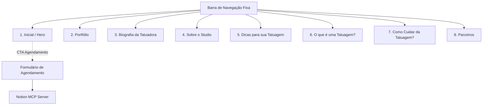
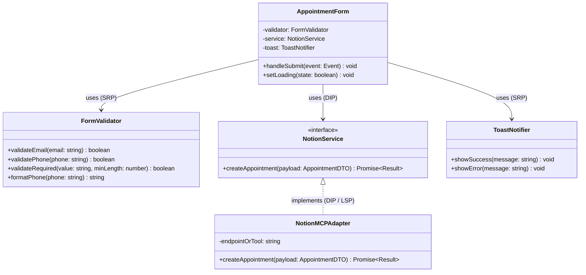
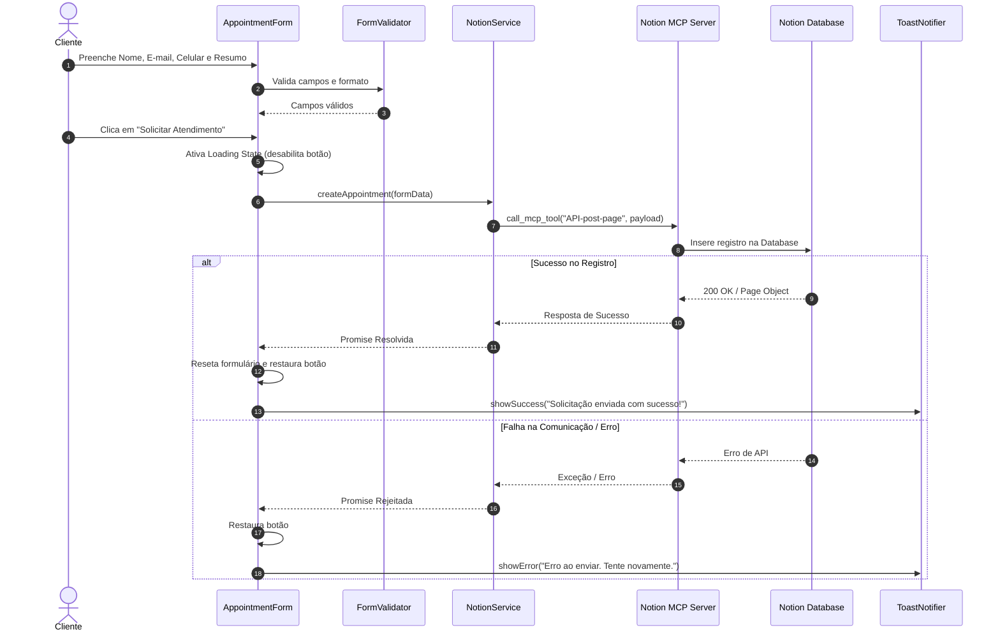

# Software Design Document (SDD)
## Sistema Web do Estúdio de Tatuagem com Integração Notion MCP

---

## 1. Visão Geral e Objetivos do Produto

### 1.1. Contexto do Projeto
O presente documento especifica o design de software e a arquitetura técnica para o website institucional e interativo de um **Estúdio de Tatuagem**. O projeto tem como propósito criar uma presença digital sofisticada, conectando clientes à tatuadora, expondo seu portfólio artístico, educando o público sobre o universo da tatuagem e cuidados, e otimizando a captação de clientes por meio de um canal direto e automatizado de agendamentos.

### 1.2. Proposta de Valor
* **Apresentação Artística e Identidade:** Exibir a estética, biografia e trabalhos da tatuadora através de galerias visuais imersivas e dinâmicas.
* **Educação e Engajamento:** Fornecer guias sobre estilos, escolhas de design e cuidados pós-sessão para transmitir confiança e autoridade.
* **Captação Automatizada de Leads:** Permitir que o cliente solicite um atendimento preliminar (online ou presencial no estúdio) para definição de arte, posicionamento e orçamento, enviando os dados diretamente para o Notion via MCP Server.

### 1.3. Personas e Atores do Sistema
* **Cliente / Visitante:** Usuário que navega pelas seções, visualiza os trabalhos no carrossel, consome dicas e solicita agendamento/orçamento.
* **Tatuadora / Gestão do Estúdio:** Responsável que recebe e gerencia as solicitações de agendamento registradas em tempo real na base de dados do Notion.

---

## 2. Arquitetura da Informação e Mapa de Seções

O website será construído em formato *Single Page Application (SPA)* com navegação fluida por rolagem (*smooth scroll*) e pontos de ancoragem (*anchor links*), dividido em 8 seções principais:



### Detalhamento das 8 Seções

| # | Seção | Descrição & Funcionalidades | Origem do Conteúdo |
|---|---|---|---|
| **1** | **Inicial (Hero)** | Tela de impacto com tipografia refinada, slogan, imagem/vídeo de destaque e Botão de Ação (CTA) direto para o agendamento. | Definido no layout |
| **2** | **Portfólio** | Galeria interativa de alta fidelidade com **Carrossel de Imagens** (setas, indicadores/bullets, suporte a swipe touch e visualização ampliada). | Pasta `Recursos/` (imagens e legendas) |
| **3** | **Biografia da Tatuadora** | Trajetória artística, filosofia de trabalho, especialidades (ex: Fineline, Blackwork, Realismo) e foto de destaque. | Arquivo `Recursos/conteudo.txt` |
| **4** | **Sobre o Studio** | Apresentação do espaço físico, protocolo de higiene, biossegurança, conforto e experiência do estúdio. | Layout / `Recursos/conteudo.txt` |
| **5** | **Dicas de Escolha** | Guia prático sobre como definir tamanho, local do corpo, referências e estilo da tatuagem. | Arquivo `Recursos/conteudo.txt` |
| **6** | **O que é uma Tatuagem?** | Conteúdo conceitual, histórico e cultural sobre a tatuagem como expressão de identidade e arte perene. | Arquivo `Recursos/conteudo.txt` |
| **7** | **Cuidados Pós-Tatuagem** | Guia passo a passo de cicatrização, produtos recomendados, o que evitar e cronograma de recuperação. | Arquivo `Recursos/conteudo.txt` |
| **8** | **Parceiros** | Vitrine de marcas parceiras com logotipos, breves descrições e links externos seguros para produtos e sites oficiais. | Arquivo `Recursos/conteudo.txt` |

---

## 3. Arquitetura de Software e Princípios SOLID

A estrutura do projeto adota uma arquitetura modular desacoplada, garantindo escalabilidade, facilidade de manutenção e alta testabilidade.

### 3.1. Estrutura de Diretórios Recomendada

```text
projeto-tatuagem/
├── Recursos/                      # Pasta de insumos reais fornecidos
│   ├── conteudo.txt               # Textos de base para seções 2, 3, 5, 6, 7 e 8
│   └── imagens/                   # Fotos em alta resolução (portfólio, estúdio, perfil)
├── public/                        # Assets estáticos finais
│   └── icons/                     # Ícones vetoriais (SVG)
├── src/
│   ├── css/
│   │   ├── variables.css          # Cores, tipografia, espaçamentos e tokens de design
│   │   ├── base.css               # Reset, tipografia global e utilitários
│   │   ├── components.css         # Estilos dos componentes isolados (carrossel, toasts, form)
│   │   └── sections.css           # Estilos específicos de cada uma das 8 seções
│   ├── js/
│   │   ├── components/
│   │   │   ├── Carousel.js        # Componente autônomo de carrossel de imagens
│   │   │   ├── Navigation.js      # Controle de menu mobile, active scroll e navegação suave
│   │   │   ├── AppointmentForm.js # Gerenciador de eventos e ciclo de vida do formulário
│   │   │   └── Toast.js           # Gerenciador de notificações flutuantes (Sucesso/Erro)
│   │   ├── services/
│   │   │   ├── contentLoader.js   # Leitor e parser de dados de Recursos/conteudo.txt
│   │   │   └── notionService.js   # Adapter/Client para envio de dados ao Notion MCP
│   │   ├── validators/
│   │   │   └── formValidator.js   # Validações puras (Regex de e-mail, máscara de telefone)
│   │   └── app.js                 # Ponto de entrada (Bootstrap e injeção de dependências)
│   └── index.html                 # Estrutura HTML5 semântica e acessível
├── SDD.md                         # Este documento de especificação
└── README.md                      # Documentação de execução e desenvolvimento
```

### 3.2. Aplicação dos Princípios SOLID



1. **S - Single Responsibility Principle (Princípio da Responsabilidade Única):**
   * `formValidator.js` é uma função/classe pura responsável exclusivamente por validar dados e aplicar máscaras de texto, sem conhecimento sobre o DOM ou a API.
   * `notionService.js` trata unicamente da comunicação e formato de payload com o Notion.
   * `Toast.js` é responsável apenas por criar, animar e remover toasts da interface.
2. **O - Open/Closed Principle (Princípio Aberto/Fechado):**
   * O leitor de conteúdo (`contentLoader.js`) e a renderização das seções são abertos para novas seções sem que seja necessário reescrever os componentes visuais essenciais.
3. **L - Liskov Substitution Principle (Princípio da Substituição de Liskov):**
   * A camada de serviço de envio implementa uma interface padronizada. Qualquer adapter alternativo (ex: MockService para testes locais) pode substituir `NotionMCPAdapter` sem alterar o comportamento de `AppointmentForm`.
4. **I - Interface Segregation Principle (Princípio da Segregação de Interfaces):**
   * Em vez de um objeto de utilitários monolítico, cada componente consome apenas os métodos específicos necessários (ex: validação de email isolada de validação de telefone).
5. **D - Dependency Inversion Principle (Princípio da Inversão de Dependência):**
   * O controlador do formulário depende de abstrações de serviço para salvar os dados, injetadas durante a inicialização em `app.js`.

---

## 4. Gestão de Conteúdo e Assets (Pasta `Recursos/`)

### 4.1. Estrutura e Formato dos Dados
A pasta `Recursos/` contém o conteúdo autêntico fornecido para popular as seções:
* **Arquivo `Recursos/conteudo.txt`:** Estruturado com delimitadores de seções ou formato chave-valor para parsing direto, por exemplo:
  ```text
  [SECAO_BIOGRAFIA]
  titulo: Sobre a Tatuadora
  texto: Formada em Artes Visuais com mais de 8 anos de experiência em traços finos e exclusivos...

  [SECAO_DICAS]
  dica_1: Como escolher o local ideal do corpo...
  dica_2: Referências visuais vs. Cópias...

  [SECAO_O_QUE_E_TATUAGEM]
  conteudo: A tatuagem é uma manifestação artística milenar...

  [SECAO_CUIDADOS]
  fase_1: Primeiras 48 horas - Higienização e plástico filme...
  fase_2: Cicatrização - Hidratação e pomadas cicatrizantes...

  [SECAO_PARCEIROS]
  parceiro_1_nome: Electric Ink
  parceiro_1_link: https://...
  parceiro_1_descricao: Tintas veganas e seguras certificadas pela Anvisa.
  ```

* **Pasta `Recursos/imagens/`:** Contém as fotografias organizadas por identificadores (`portfolio-01.jpg`, `portfolio-02.jpg`, `studio-01.jpg`, `tatuadora.jpg`).

### 4.2. Módulo de Carga (`contentLoader.js`)
* Realiza a leitura e categorização do arquivo de texto.
* Injeta o conteúdo dinamicamente nos nós semânticos do HTML correspondentes no carregamento inicial da página (`DOMContentLoaded`).

---

## 5. Especificação de Componentes UI/UX

### 5.1. Design System & Identidade Visual
* **Estilo Geral:** Minimalismo Moderno & Dark Aesthetic Premium (predomínio de tons escuros sofisticados, detalhes em tons metálicos/dourados ou acinzentados, efeitos sutis de *Glassmorphism*).
* **Tipografia:** 
  * Títulos: *Cinzel* / *Playfair Display* ou *Syne* (elegância e arte).
  * Corpo e Textos: *Inter* ou *Plus Jakarta Sans* (alta legibilidade em telas).
* **Micro-animações:** Transições suaves de *fade-in* e *slide-up* acionadas via `IntersectionObserver` à medida que o usuário rola a página.

### 5.2. Componente: Carrossel de Imagens (`Carousel.js`)
* **Comportamento:**
  * Exibe 1 imagem em destaque (mobile) ou cards múltiplos (desktop) com navegação fluida.
  * **Controles Visuais:** Setas laterais personalizadas (Next / Prev) e indicadores circulares inferiores (Bullets/Dots) que refletem o slide atual.
  * **Interatividade Touch:** Suporte nativo a gestos de arrasto (*swipe left/right*) em telas sensíveis ao toque.
  * **Acessibilidade:** Navegação por teclas direcionais (`ArrowLeft`, `ArrowRight`) quando focado, com atributos `aria-live="polite"`.

```text
[ < (Seta Anterior) ]   [ Imagem do Portfólio 02 / 10 ]   [ (Seta Próxima) > ]
                             ●  ○  ○  ○  ○  ○
```

### 5.3. Componente: Formulário de Agendamento (`AppointmentForm.js`)
* **Campos do Formulário:**
  1. `Nome Completo` (input texto, obrigatório).
  2. `E-mail` (input email, obrigatório, com validação de formato).
  3. `Celular (WhatsApp)` (input tel, obrigatório, com máscara dinâmica).
  4. `Resumo da Ideia` (textarea, obrigatório - descrição da ideia, tamanho aproximado, local do corpo e preferência: Presencial no estúdio ou Online).

* **Estados de Validação & UX:**
  * **Validação em Tempo Real:** Ao sair do campo (`blur`) e ao digitar (`input`), com exibição de mensagem de erro contextual abaixo do campo.
  * **Bloqueio de Envio:** O botão de submit só fica habilitado quando todos os 4 campos forem estritamente válidos.
  * **Estado de Carregamento (Loading):** Botão exibe spinner animado e desabilita interações durante a comunicação com o Notion MCP Server.

### 5.4. Componente de Notificações (`Toast.js`)
* **Success Toast:** Banner flutuante verde-esmeralda/dourado no canto superior ou inferior direito, com ícone de confirmação: *"Solicitação enviada com sucesso! A tatuadora entrará em contato para alinhar os detalhes."*
* **Error Toast / Error State:** Notificação flutuante com mensagem explicativa e bordas destacadas: *"Não foi possível enviar sua solicitação no momento. Por favor, tente novamente."*

---

## 6. Especificação da Integração Notion MCP Server

### 6.1. Schema Estrito da Base de Dados no Notion
A integração deve utilizar exclusivamente os 4 campos acordados:

| Propriedade no Notion | Tipo no Notion | Descrição | Validação Frontend |
|---|---|---|---|
| **Nome** | `title` (Título da página) | Nome completo do cliente | Obrigatório (Min. 3 caracteres) |
| **E-mail** | `email` | Endereço de e-mail de contato | Regex RFC 5322 obrigatório |
| **Celular** | `phone_number` ou `rich_text` | Telefone com DDD e WhatsApp | Máscara `(XX) XXXXX-XXXX` |
| **Resumo** | `rich_text` | Detalhes da tatuagem e preferência (online/presencial) | Obrigatório (Min. 10 caracteres) |

### 6.2. Diagrama de Sequência da Integração



### 6.3. Contrato de Payload para o Notion MCP
Exemplo de estrutura enviada via MCP tool `API-post-page`:

```json
{
  "parent": {
    "database_id": "DATABASE_ID_CONFIGURADO"
  },
  "properties": {
    "Nome": {
      "title": [
        {
          "text": {
            "content": "Mariana Souza"
          }
        }
      ]
    },
    "E-mail": {
      "email": "mariana.souza@email.com"
    },
    "Celular": {
      "rich_text": [
        {
          "text": {
            "content": "(11) 98765-4321"
          }
        }
      ]
    },
    "Resumo": {
      "rich_text": [
        {
          "text": {
            "content": "Tatuagem botânica no antebraço direito, cerca de 12cm. Preferência por atendimento presencial no estúdio."
          }
        }
      ]
    }
  }
}
```

---

## 7. Matriz de Validação e Regras de Negócio

### 7.1. Regras de Validação de Dados

```javascript
// Exemplo de Especificação do FormValidator (SRP)
export const FormValidator = {
  // Regex oficial baseado em RFC 5322 simplificado
  emailRegex: /^[a-zA-Z0-9._%+-]+@[a-zA-Z0-9.-]+\.[a-zA-Z]{2,}$/,

  validateEmail(email) {
    return this.emailRegex.test(String(email).trim());
  },

  validatePhone(phone) {
    const rawDigits = phone.replace(/\D/g, '');
    return rawDigits.length === 10 || rawDigits.length === 11;
  },

  formatPhoneMask(value) {
    const digits = value.replace(/\D/g, '').slice(0, 11);
    if (digits.length <= 10) {
      return digits.replace(/^(\d{2})(\d{4})(\d{0,4})/, '($1) $2-$3').trim();
    }
    return digits.replace(/^(\d{2})(\d{5})(\d{0,4})/, '($1) $2-$3').trim();
  },

  validateRequired(text, minLength = 3) {
    return typeof text === 'string' && text.trim().length >= minLength;
  }
};
```

---

## 8. Requisitos Não Funcionais (RNF)

1. **Performance e Otimização:**
   * Todas as imagens das seções e do portfólio devem utilizar carregamento preguiçoso (*Lazy Loading* com atributo `loading="lazy"` ou `IntersectionObserver`).
   * Imagens comprimidas no formato WebP para garantir que o tempo de carregamento da página seja inferior a 2 segundos em conexões 4G.
2. **Mobile-First & Responsividade:**
   * O layout deve priorizar telas mobile (smartphones de 360px até 430px de largura) e escalar fluidamente até telas Ultra-Wide (4K).
3. **Acessibilidade (WCAG 2.1 Nível AA):**
   * Contraste mínimo de cor 4.5:1 entre textos e plano de fundo.
   * Todos os botões e elementos interativos do carrossel e formulário possuem tags semânticas e rótulos acessíveis (`aria-label`).
4. **Segurança e Proteção de Dados (LGPD):**
   * Sanitização rigorosa no cliente contra *Cross-Site Scripting (XSS)* no campo de texto livre (*Resumo*).
   * Inclusão de aviso de privacidade explícito antes do envio do formulário.

---

## 9. Critérios de Aceite e Matriz de Testes

| ID | Cenário / Funcionalidade | Condição de Teste | Resultado Esperado |
|---|---|---|---|
| **CA-01** | **Navegação Geral** | Clicar em qualquer item do menu ou link interno. | A tela rola suavemente até o tópico selecionado correspondente (1 a 8). |
| **CA-02** | **Carrossel de Imagens** | Clicar nas setas, nos bullets ou efetuar swipe touch. | As imagens transitam de forma fluida sem corte ou distorção, atualizando o indicador ativo. |
| **CA-03** | **Carga de Conteúdo** | Carregar a página com o arquivo `conteudo.txt` preenchido. | Os tópicos 2, 3, 5, 6, 7 e 8 são populados automaticamente com as informações oficiais. |
| **CA-04** | **Validação de Formulário** | Tentar submeter com e-mail inválido, telefone incompleto ou campos vazios. | O envio é impedido, o botão permanece bloqueado e mensagens visuais de erro são exibidas. |
| **CA-05** | **Sucesso no Agendamento** | Preencher todos os 4 campos corretamente e enviar. | Botão exibe estado de loading, dados são inseridos na tabela do Notion e o **Success Toast** é exibido. |
| **CA-06** | **Falha na Integração Notion** | Simular desconexão ou erro de API durante o envio. | O sistema não quebra, o formulário recupera o estado e o **Error Toast** informa o usuário amigavelmente. |

---

## 10. Recomendações de Skills e Ferramentas Antigravity

Para a execução deste projeto dentro do ambiente Antigravity, recomendam-se as seguintes configurações:
1. **`notion-mcp-server`**: Configurado e autenticado no workspace para permitir o roteamento do payload do formulário diretamente para a database do Notion.
2. **`antigravity-guide` & `agy-customizations`**: Para referência de comandos de planejamento, scaffolding e automações do ambiente.
3. **Módulo de Otimização Visual**: Utilização do workflow de testes em browser para validação visual do carrossel responsivo e feedback dos toasts.
